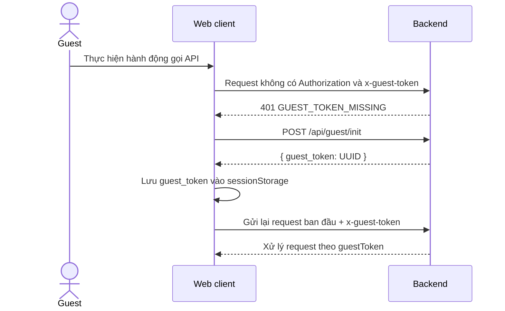
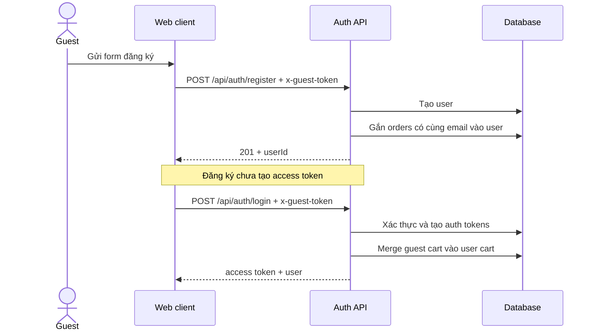
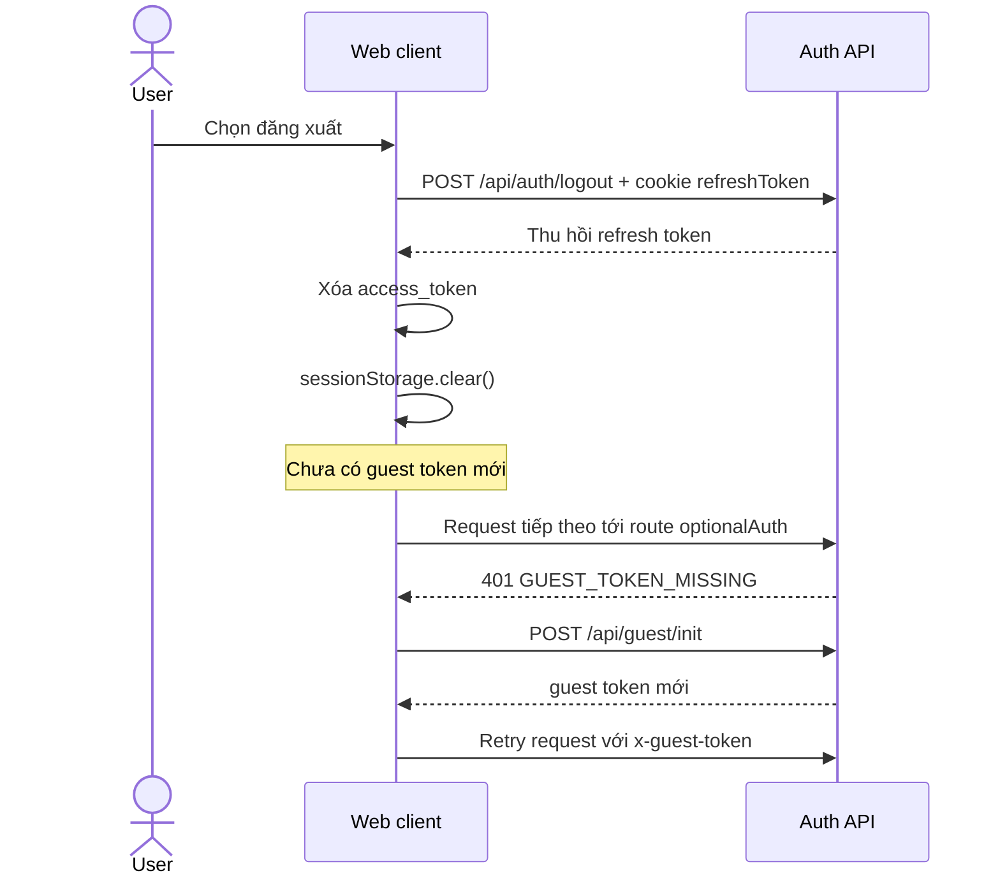

# Luồng xác thực khách vãng lai và người dùng

Tài liệu này mô tả cách backend và web client nhận diện khách vãng lai
(`guest`), cô lập giỏ hàng giữa các guest session, và chuyển đổi dữ liệu khi
khách đăng ký, đăng nhập hoặc đăng xuất.

> Phạm vi: tài liệu phản ánh hành vi hiện tại của
> `GIOFCHAR_BACKEND_NODEJS` và `GioChaWebClient`. Đây không phải mô tả một
> thiết kế mong muốn trong tương lai.

## 1. Mục tiêu của guest token

Khách chưa đăng nhập không có `userId`. Nếu mọi khách đều được biểu diễn bằng
`userId = NULL`, backend không thể xác định giỏ hàng nào thuộc về khách nào.

Hệ thống giải quyết vấn đề này bằng cách cấp cho mỗi guest session một UUID:

```text
Guest session A -> guestToken A -> cart A -> orders của A
Guest session B -> guestToken B -> cart B -> orders của B
```

Web client gửi UUID trong header:

```http
x-guest-token: <uuid>
```

Backend dùng `guestToken` làm định danh chủ sở hữu thay cho `userId` khi khách
chưa đăng nhập. Vì token được lưu trong `sessionStorage`, phạm vi nhận diện
chính xác là một browser tab/session, không phải một con người ngoài đời:

- Hai tab có thể có hai guest token và hai giỏ hàng khác nhau.
- Đóng tab rồi mở phiên mới có thể làm mất liên kết với giỏ hàng cũ.
- Hai người dùng chung một browser session có thể dùng chung guest token.

## 2. Hai loại danh tính

| Trạng thái | Thông tin client gửi | Danh tính backend sử dụng |
| --- | --- | --- |
| Guest | `x-guest-token` | `{ userId: null, guestToken, role: "user" }` |
| Đã đăng nhập | `Authorization: Bearer <access_token>` | `{ userId, guestToken: null, role }` |

Axios interceptor có thể gửi đồng thời cả hai header nếu cả hai token vẫn còn
trong storage. Trong trường hợp đó, `optionalAuth` ưu tiên access token hợp lệ
và chủ động đặt `guestToken` trong `req.user` thành `null`.

`optionalAuth` không có nghĩa là request được phép thiếu mọi loại danh tính.
Middleware này yêu cầu ít nhất một trong hai:

- Access token hợp lệ; hoặc
- Guest token.

Nếu thiếu cả hai, backend trả:

```http
HTTP/1.1 401 Unauthorized
Content-Type: application/json

{
  "code": "GUEST_TOKEN_MISSING"
}
```

`requireAuth` chặt hơn: middleware này chỉ chấp nhận access token và không dùng
guest token để thay thế.

## 3. Khởi tạo guest session

Guest token hiện được khởi tạo theo cơ chế lazy: client không nhất thiết gọi API
khởi tạo ngay khi ứng dụng mở.



Chi tiết:

1. Axios request interceptor đọc `guest_token` từ `sessionStorage`.
2. Nếu có token, interceptor gắn nó vào header `x-guest-token`.
3. Nếu chưa có token, request đầu tiên đi tới một route dùng `optionalAuth` sẽ
   nhận lỗi `GUEST_TOKEN_MISSING`.
4. Axios response interceptor gọi `ensureGuestToken()`.
5. `POST /api/guest/init` tạo UUID mới và trả về `guest_token`.
6. Client lưu token vào `sessionStorage`.
7. Request bị lỗi được gửi lại một lần với guest token mới.

Biến `guestInitPromise` giúp nhiều request đồng thời dùng chung một lần khởi
tạo, thay vì mỗi request tự tạo một guest token khác nhau.

Đây là khởi tạo hoặc khôi phục guest identity khi token bị thiếu, không phải
refresh theo nghĩa gia hạn token. Guest token hiện không có expiry và backend
không ký hoặc xác minh UUID này như JWT.

## 4. Guest thao tác với giỏ hàng và đơn hàng

### 4.1 Giỏ hàng

Các route thao tác giỏ hàng của người mua sử dụng `optionalAuth`. Sau khi
middleware tạo `req.user`, service chọn chủ sở hữu:

```text
Có userId     -> tìm hoặc tạo cart theo userID
Không userId  -> tìm hoặc tạo cart theo guestToken
```

Đây là cơ chế trực tiếp ngăn guest A nhìn thấy hoặc sửa giỏ hàng của guest B.
Mỗi thao tác thêm, đọc, xóa item đều được thực hiện trên cart tìm được từ danh
tính trong `req.user`.

### 4.2 Đơn hàng guest

Khi checkout bằng `POST /api/orders/guest/cod`:

1. `optionalAuth` lấy `guestToken` từ header.
2. Cart service tìm giỏ hàng theo token đó.
3. Order service tạo đơn với `guestToken` là chủ sở hữu và `userID` chưa có.
4. Khi xem hoặc hủy đơn qua route có `authorizeOrderAccess`, backend kiểm tra
   order có thuộc `userId` hoặc `guestToken` hiện tại hay không.

Guest token vì vậy cần được xem như một bearer credential: ai có token có thể
được backend nhận diện là guest session đó. Không nên log raw token hoặc chia sẻ
token qua URL.

## 5. Guest chuyển sang đăng ký



Hành vi hiện tại cần lưu ý:

- `POST /auth/register` chỉ tạo tài khoản, không tự đăng nhập.
- Nếu request đăng ký có guest token, backend gọi
  `tryAttachOrderToUser({ email, userId })`.
- Việc gắn order hiện dựa trên email của đơn hàng, không đối chiếu
  `guestToken` trong câu `UPDATE`.
- Đăng ký không merge guest cart.
- Nếu giao diện muốn đăng nhập ngay sau đăng ký, client phải gọi `/auth/login`.
  Chính bước login mới merge guest cart.

## 6. Guest chuyển sang đăng nhập

Khi một guest đăng nhập vào tài khoản đã tồn tại:

1. Axios gửi cả thông tin đăng nhập và `x-guest-token` đang lưu.
2. Backend kiểm tra email và password.
3. Backend tạo access token và refresh token.
4. Refresh token được lưu trong database và gửi cho client bằng cookie
   `httpOnly`.
5. Nếu request có guest token, backend merge guest cart vào user cart trong
   transaction.
6. Client lưu access token vào `localStorage`.
7. Các request sau ưu tiên danh tính `userId` từ access token.

### Quy tắc merge giỏ hàng

| Trạng thái trước login | Kết quả |
| --- | --- |
| Guest không có cart | Không có dữ liệu để merge |
| Guest có cart, user chưa có cart | Chuyển cart guest sang user bằng cách gán `userID` và xóa `guestToken` |
| Guest và user đều có cart | Cộng số lượng item trùng variant, chép item chưa có, sau đó xóa guest cart |

Merge được chạy trong database transaction. Nếu có lỗi, transaction rollback và
login vẫn trả kết quả kèm trạng thái merge thất bại.

## 7. Người dùng đăng xuất và trở lại guest



Sau logout:

- Access token bị xóa khỏi `localStorage`.
- Toàn bộ `sessionStorage`, bao gồm guest token cũ, bị xóa.
- User cart vẫn thuộc tài khoản và không được chuyển ngược thành guest cart.
- Guest token mới được cấp ở lần tiếp theo client cần gọi route dùng
  `optionalAuth`.
- Guest session mới bắt đầu với một giỏ hàng riêng; nó không kế thừa user cart.

Luồng “đăng nhập -> guest” vì vậy không phải đảo ngược thao tác merge. Dữ liệu
đã merge tiếp tục thuộc user; guest mới là một identity độc lập.

## 8. Access token hết hạn hoặc không hợp lệ

Hai cơ chế retry cần được phân biệt:

| Trường hợp | Client xử lý |
| --- | --- |
| `GUEST_TOKEN_MISSING` | Tạo guest token rồi retry request |
| `ACCESS_TOKEN_EXPIRED` | Dùng refresh-token cookie lấy access token mới rồi retry |
| Access/refresh token không hợp lệ | Phát sự kiện `forceLogout`, xóa local auth state |

Nếu request gửi access token hết hạn cùng với guest token hợp lệ,
`optionalAuth` vẫn ưu tiên access token và trả lỗi access token; nó không âm
thầm hạ request xuống quyền guest.

## 9. Các file triển khai chính

### Backend

- `src/routes/guest.route.js`: tạo guest UUID.
- `src/middlewares/auth.middleware.js`: xây dựng `req.user`, phân biệt
  `optionalAuth` và `requireAuth`.
- `src/services/cart.service.js`: tìm/tạo cart theo owner và merge guest cart.
- `src/services/auth.service.js`: đăng ký, đăng nhập, logout và gọi merge.
- `src/services/order.service.js`: kiểm tra owner và gắn order vào user.
- `src/controllers/auth.controller.js`: đọc `x-guest-token` khi đăng ký/login.

### Web client

- `src/apis/configAxios.ts`: tự động gắn các token, xử lý 401 và retry.
- `src/apis/guestApi.ts`: gọi `/guest/init`, lưu token và chống gọi trùng.
- `src/context/AuthContext.tsx`: lưu access token, quản lý account và xóa
  storage khi logout.

## 10. Giới hạn và rủi ro hiện tại

1. Guest token là UUID do client nắm giữ nhưng backend chưa lưu session, chưa
   có expiry và chưa có cơ chế thu hồi.
2. `POST /guest/init` có thể được gọi tự do để tạo token mới.
3. Dùng `sessionStorage` giúp cô lập theo tab nhưng làm guest cart khó duy trì
   sau khi đóng tab.
4. Client dùng `sessionStorage.clear()` khi logout, có thể xóa cả dữ liệu
   session không liên quan đến authentication.
5. Luồng attach order khi đăng ký cập nhật theo email thay vì kết hợp email với
   guest token. Quy tắc này cần được đánh giá kỹ vì email là dữ liệu người dùng
   nhập, không phải bằng chứng sở hữu guest session.
6. Client vẫn giữ guest token sau login thông thường. Header có thể tiếp tục
   được gửi, dù backend ưu tiên access token và bỏ qua guest token.

Khi thay đổi luồng này, cần kiểm thử tối thiểu:

- Hai guest session không đọc hoặc sửa giỏ hàng của nhau.
- Guest cart được giữ nguyên nếu login thất bại.
- Merge đúng khi chỉ guest có cart, chỉ user có cart, hoặc cả hai có cart.
- Item trùng variant được cộng đúng số lượng.
- Lỗi giữa quá trình merge rollback toàn bộ transaction.
- Đăng ký không vô tình nhận order chỉ vì trùng email.
- Logout không làm user cart trở thành guest cart.
- Nhiều request đồng thời khi thiếu guest token chỉ tạo một guest identity trên
  cùng client session.
